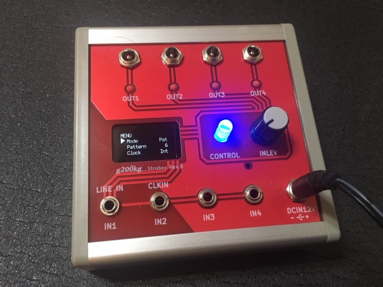

# Strober
Strober, the programmable LED flasher hardware design

## Overview

* OUT1 - 4 is output signals that can drive LED lights (+12V) (up to about 20W / output, depends on power source and sequence pattern).
* 4 input ,Eurorack synth Gate signals or line level audio (for IN1 audio input).
* Require +12V Power supply and 12V LED lights
* Programmable flashing control
* Controlled with Arduino Nano

GitHub repository : [https://github.com/g200kg/strober](https://github.com/g200kg/strober)  
Fontpage : [https://g200kg.github.io/strober](https://g200kg.github.io/strober)

## Files

| File                                             | Description               |
|--------------------------------------------------|---------------------------|
|[StroberManual.pdf](docs/StroberManual.pdf)       | Manual (Japanese/English) |
|[StroberSchematic.pdf](docs/StroberSchematic.pdf) | Schematic                 |
|[sketch_Strober.ino](docs/sketch_Strober.ino)     | Source Code (Arduino)     |

## Software Overview

Strober has 3 modes.

### Pat mode
 
In this mode, the LEDs flash according to the programmed flash sequence.
The sequence is performed by the built-in mic or line signal input. Or it is triggered periodically by the setting of AutoTrig.

IN1 is audio signal input.  
IN2 is external clock input.

|Menu      | Description                      |
|----------|----------------------------------|
| Pattern  | 1-8, programmable sequence pattern select. Enter edit mode of each sequence pattern by long press |
| Clock    | Int / Ext. the clock source. If Ext, the clock source sould be input to IN2.
| ClkBPM   | 30-300, Internal Clock Source BPM |
| ReTrig   | On/Off, retrigger mode. If 'On', the trigger signal resets the flash sequence currently in progress and restarts from the beginning|
|AutoTrig  | 0-100, The sequence is automatically triggered. 0: not trigger, 1-100: periodically trigger after 1-100 clicks.|
|AudioIn   | Mic / Line, input signal select built-in mic or line audio in signal, that will generate trigger.|
|Save  | Save current settings to EEPROM.|
|InitAll | Initialize all data to Factory default.|

### Pattern Edit
|Menu      |  Description                        |
|----------|-------------------------------------|
| Each grid of pattern | by click, cycle off / short / medium / long. For 'long', the length specified by duty, half for 'middle' and 1/4 for 'short'. |
| Step     | 1-16 , sequence length |
| Duty     | 1-100, 'On' duty of each grid.  If 100 and the grid is 'long', it will light continuously for the length of the grid.  The actual length depends on the "short, medium and long" of each grid.|

### Dir mode

This is a Direct drive mode. The input GATE signal (IN1 - IN4) will drive directly eath output signal.

|Menu       |  Description                    |
|-----------|---------------------------------|
| Assign    | 4:4 , IN1-4 => OUT1-4 2:4 , IN1 => OUT1-2, IN2=> OUT3-4 1:4 , IN1 => OUT1-4|
| Save      | Same as Pat mode|
| InitAll   | Same as Pat mode|

### Lev mode

In this mode, OUT1 to OUT4 are lighted sequentially depending on the signal level like a VU meter. The audio signal should be select built-in mic or audio line level signal of IN1.

|Menu       | Description                     |
|-----------|---------------------------------|
| AudioIn   | Mic / Line , Audio source select|

## Arduino Nano Port mapping

| Function | Pin    |
|----------|--------|
|   IN1    |   D6   |
|   IN2    |   D8   |
|   IN3    |   D7   |
|   IN4    |   D9   |
|   OUT1   |   D13  |
|   OUT2   |   D12  |
|   OUT3   |   D11  |
|   OUT4   |   D10  |
|   MICIN  |   A0   |
|   LINEIN |   A1   |
|   POT    |   A2   |
|   ENCA   |   D2   |
|   ENCB   |   D3   |
|   BTN    |   D4   |

## License
Released under MIT license.
